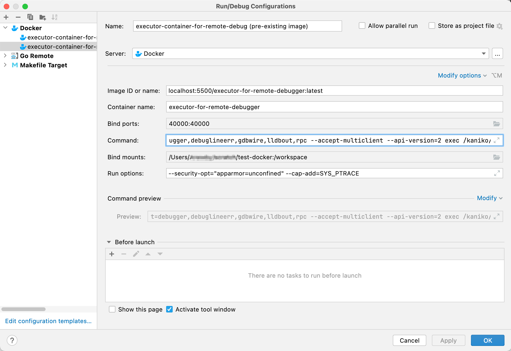
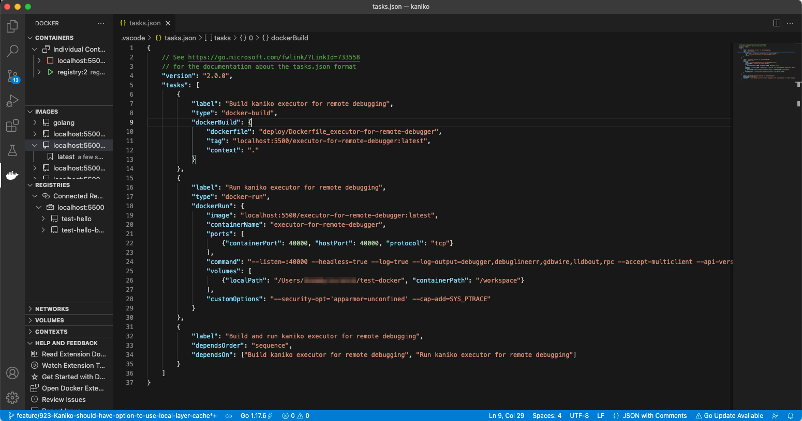
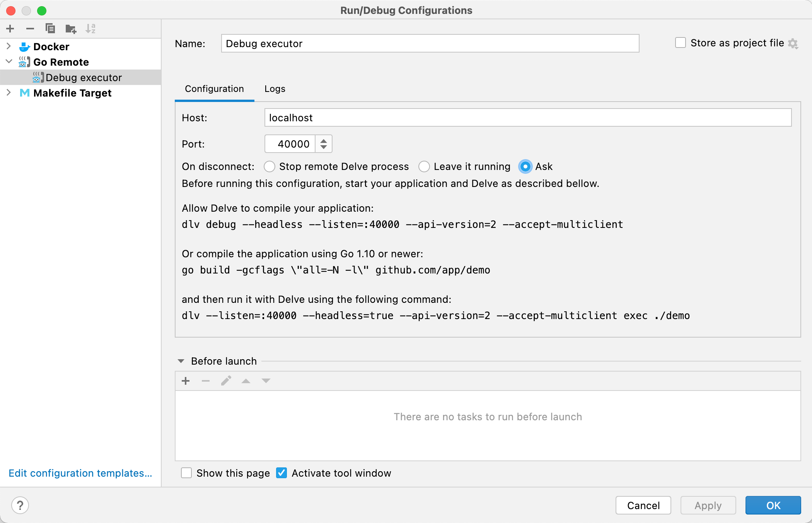
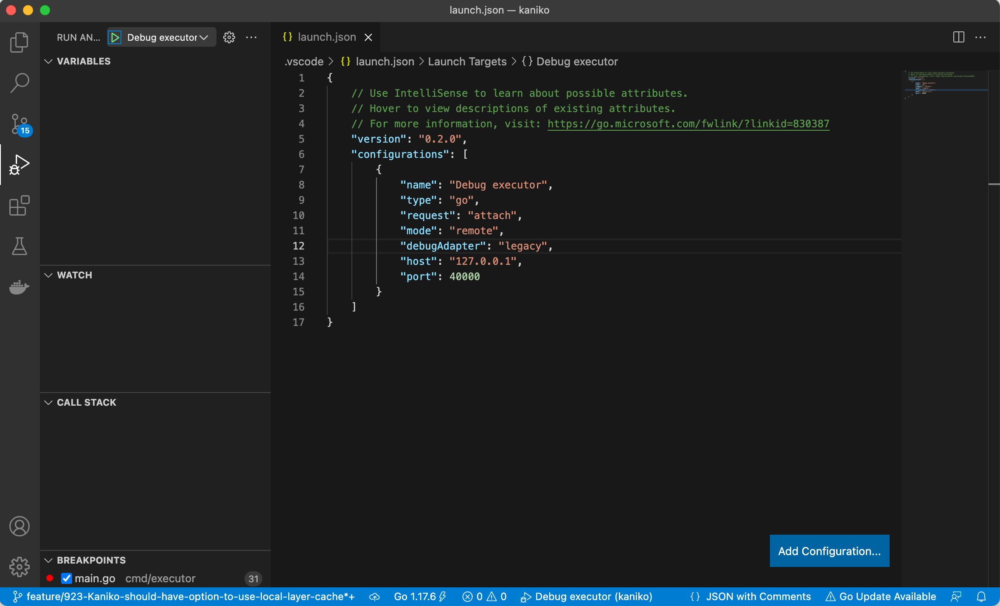

# Running kaniko in a remote debugger

## Acknowledgements

These instructions borrow heavily from:

* [JetBrains: Debugging a Go application inside a Docker container](https://blog.jetbrains.com/go/2020/05/06/debugging-a-go-application-inside-a-docker-container/)
* [Golang for all: Remote debugging with Delve](https://golangforall.com/en/post/go-docker-delve-remote-debug.html)

## Basic workflow

There are two approaches you can take to launch a debugging session:

### From pre-built Docker image

1. Build Docker image using `make images`
2. Launch container from image
3. Set breakpoint in IDE
4. Attach IDE remote debugger
5. Debug

### From Dockerfile

1. Launch container from image built directly from Dockerfile
2. Set breakpoint in IDE
3. Attach IDE remote debugger
4. Debug

## HOWTO - Build Docker images

While developing, it is quicker and safer to set up a [Local repository](#local-repository) which you can use for storing your images as
you go through the development process.  These instructions assume you are following that practice.

When running `make`, it is also important to set your environment to point to the same local repository to avoid pushing
intermediate work product to the public repository.

```shell
export REGISTRY=localhost:5500
```

___Note: Although instructions elsewhere in this repository recommend setting your local repository to listen on `TCP/5000`,
macOS versions from Monterey onwards [use this port for AirPlay Receiver](https://daily-dev-tips.com/posts/thank-you-apple-for-hijacking-port-5000/).
So, instructions in this section use `TCP/5500` instead.  Feel free to adjust to your own preferences.  Just make sure that `IMAGE_REPO` and `REGISTRY`
are both set and point to the same place.___

Once your environment is set up, you can rebuild a complete set of images:

```shell
~/repos/go/src/github.com/GoogleContainerTools/kaniko $ make images

docker build  --build-arg=GOARCH=amd64 -t localhost:5500/executor:latest -f deploy/Dockerfile .
[+] Building 3.7s (25/25) FINISHED
 => [internal] load build definition from Dockerfile                                                                                                                                                        0.0s
 <snip/>                                                                                                                                                                                         0.0s
 => => exporting layers                                                                                                                                                                                     0.0s
 => => writing image sha256:f699b3c4e09147c649bbb773121f8cd5801d6156b0a4b12eb19913753a90f84f                                                                                                                0.0s
 => => naming to localhost:5500/executor:latest                                                                                                                                                             0.0s

Use 'docker scan' to run Snyk tests against images to find vulnerabilities and learn how to fix them
docker build  --build-arg=GOARCH=amd64 -t localhost:5500/executor:debug -f deploy/Dockerfile_debug .
[+] Building 2.4s (31/31) FINISHED
 => [internal] load build definition from Dockerfile_debug                                                                                                                                                  0.0s
 <snip/>                                                                                                                                                                                      0.0s
 => => exporting layers                                                                                                                                                                                     0.0s
 => => writing image sha256:cbc459540b918c80bfd7395c5b9f1bbc4f2e12cc2d8c69a7d7b16d852edfc624                                                                                                                0.0s
 => => naming to localhost:5500/executor:debug                                                                                                                                                              0.0s

Use 'docker scan' to run Snyk tests against images to find vulnerabilities and learn how to fix them
docker build  --build-arg=GOARCH=amd64 -t localhost:5500/executor:slim -f deploy/Dockerfile_slim .
[+] Building 1.7s (15/15) FINISHED
 => [internal] load build definition from Dockerfile_slim                                                                                                                                                   0.0s
 <snip/>                                                                                                                                                                                          0.0s
 => => exporting layers                                                                                                                                                                                     0.0s
 => => writing image sha256:d67dce93339c307e6dfa76c22711079616d8c74da327e853dc6422e435681801                                                                                                                0.0s
 => => naming to localhost:5500/executor:slim                                                                                                                                                               0.0s

Use 'docker scan' to run Snyk tests against images to find vulnerabilities and learn how to fix them
docker build  --build-arg=GOARCH=amd64 -t localhost:5500/warmer:latest -f deploy/Dockerfile_warmer .
[+] Building 1.6s (24/24) FINISHED
 => [internal] load build definition from Dockerfile_warmer                                                                                                                                                 0.0s
 <snip/>                                                                                                                                                                                        0.0s
 => => exporting layers                                                                                                                                                                                     0.0s
 => => writing image sha256:c9020cea67be96e436cf1edfe7246292620f76fc67582c5b3e0c99870d88ce7a                                                                                                                0.0s
 => => naming to localhost:5500/warmer:latest                                                                                                                                                               0.0s

Use 'docker scan' to run Snyk tests against images to find vulnerabilities and learn how to fix them
docker build  --build-arg=GOARCH=amd64 -t localhost:5500/executor-for-remote-debugger:latest -f deploy/Dockerfile_executor-for-remote-debugger .
[+] Building 1.7s (26/26) FINISHED
 => [internal] load build definition from Dockerfile_executor-for-remote-debugger                                                                                                                           0.0s
 <snip/>                                                                                                                                                                                          0.0s
 => => exporting layers                                                                                                                                                                                     0.0s
 => => writing image sha256:faf014fca7608d601461c87a6ec274659a6430a67fda5f8a91ee492d7b32c08b                                                                                                                0.0s
 => => naming to localhost:5500/executor-for-remote-debugger:latest                                                                                                                                         0.0s

Use 'docker scan' to run Snyk tests against images to find vulnerabilities and learn how to fix them
docker build  --build-arg=GOARCH=amd64 -t localhost:5500/warmer-for-remote-debugger:latest -f deploy/Dockerfile_warmer-for-remote-debugger .
[+] Building 1.9s (26/26) FINISHED
 => [internal] load build definition from Dockerfile_warmer-for-remote-debugger                                                                                                                             0.0s
 <snip/>                                                                                                                                                                                         0.0s
 => => exporting layers                                                                                                                                                                                     0.0s
 => => writing image sha256:df74d62a556b24e5d6adb81b82e8107e39dffdb5d6fbf42e6b5966ddac48df3d                                                                                                                0.0s
 => => naming to localhost:5500/warmer-for-remote-debugger:latest                                                                                                                                           0.0s

Use 'docker scan' to run Snyk tests against images to find vulnerabilities and learn how to fix them
```

You can also build a single image directly by identifying and running the relevant `docker build ...` command from
the above output.

## HOWTO - Launch an image for IDE debugging

Since Kaniko is essentially a Docker image builder, we need to give it some work to do when launching it for debugging.

We must also ensure that the container is properly configured for remote debugging when launched.

This requires the following:
* Mapping a host port to container port `TCP/40000` so the debugger can attach
* Running the container with certain security options disabled
* Mapping a host volume containing a Dockerfile and build context into the container filesystem
* Including `CMD` options to run `Delve`
* Including `CMD` options for `executor`

### Example IntelliJ configuration



### Example VSCode configuration


The full Command is as follows:

`--listen=:40000
--headless=true
--log=true
--log-output=debugger,debuglineerr,gdbwire,lldbout,rpc
--accept-multiclient
--api-version=2
exec
/kaniko/executor
--
--dockerfile
/workspace/Dockerfile
--destination
<local host IP>:5500/test-hello-by-kaniko:latest
--context
dir:///workspace/`

___Note: To avoid possibly polluting a public repository, we point `--destination` to our local Docker repository.___

___Note: We map a host directory to `/workspace` in the container filesystem.  The subsequent arguments
to `/kaniko/executor` reference this location for `--context` and `--dockerfile`.___

___Note: the lone `--` after `/kaniko/executor` tells `Delve` that everything following should be passed as arguments to the `exec`
target (`/kaniko/executor`) and not considered arguments for `Delve` itself.___

If the image has been built and launched correctly, the container log will indicate that it is listening for a
remote connection at `TCP/40000`

```shell
~/repos/go/src/github.com/GoogleContainerTools/kaniko $ docker ps
CONTAINER ID   IMAGE                                                COMMAND                  CREATED         STATUS         PORTS                      NAMES
687e0b1675f2   localhost:5500/executor-for-remote-debugger:latest   "/dlv --listen=:4000…"   9 seconds ago   Up 9 seconds   0.0.0.0:40000->40000/tcp   executor-for-remote-debugger

~/repos/go/src/github.com/GoogleContainerTools/kaniko $ docker logs 687e0b1675f2
API server listening at: [::]:40000
2022-02-17T18:10:41Z warning layer=rpc Listening for remote connections (connections are not authenticated nor encrypted)
2022-02-17T18:10:41Z debug layer=rpc API server pid = 1
2022-02-17T18:10:41Z info layer=debugger launching process with args: [/kaniko/executor --dockerfile /workspace/Dockerfile --destination <your local IP>:5500/test-hello-by-kaniko:latest --context dir:///workspace/]
2022-02-17T18:10:41Z error layer=debugger can't find build-id note on binary
```

## HOWTO - Build AND launch an image for IDE debugging

Instead of building an image at the command line using `make` or `docker build` and then launching it inside the IDE,
it would be a lot more convenient to perform both steps as a single job within the IDE.  This is, in fact, possible.

Unfortunately, at the time of writing (2022FEB17), IntelliJ platforms [do not support Docker buildkit](https://youtrack.jetbrains.com/issue/IDEA-210514),
which is a critical dependency for building the Kaniko images, and so we only provide an example for VS Code.

Essentially, we define discrete tasks for building and running the image.  Then we chain them together in a third task. 
This makes the build-run-debug cycle a lot easier to manage from purely within the IDE.



## HOWTO - Launch a remote debugger session from the IDE

Once you have a container up and running, the final step is to set a breakpoint in your source code and launch the IDE
remote debugger.

### Example IntelliJ configuration



### Example VSCode configuration

